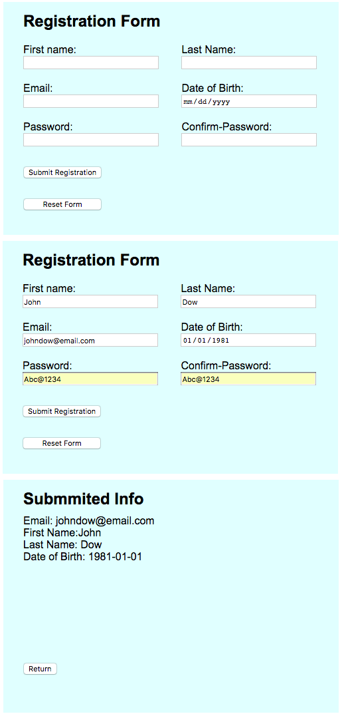

# Registration_Form_Python
Create a simple registration page with the following fields:
<ul>
  <li>email</li>
  <li>first_name</li>
  <li>last_name</li>
  <li>password</li>
  <li>confirm_password</li>
</ul>
Here are the validations you must include:
<ul>
  <li>All fields are required and must not be blank</li>
  <li>First and Last Name cannot contain any numbers</li>
  <li>Password should be more than 8 characters</li>
  <li>Email should be a valid email</li>
  <li>Password and Password Confirmation should match</li>
  <li>When the form is submitted, make sure the user submits appropriate information. If the user did not submit appropriate information, return the error(s) above the form that asks the user to correct the information.</li>
</ul>

